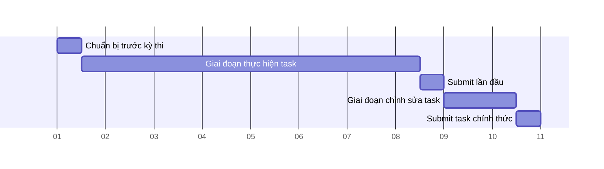
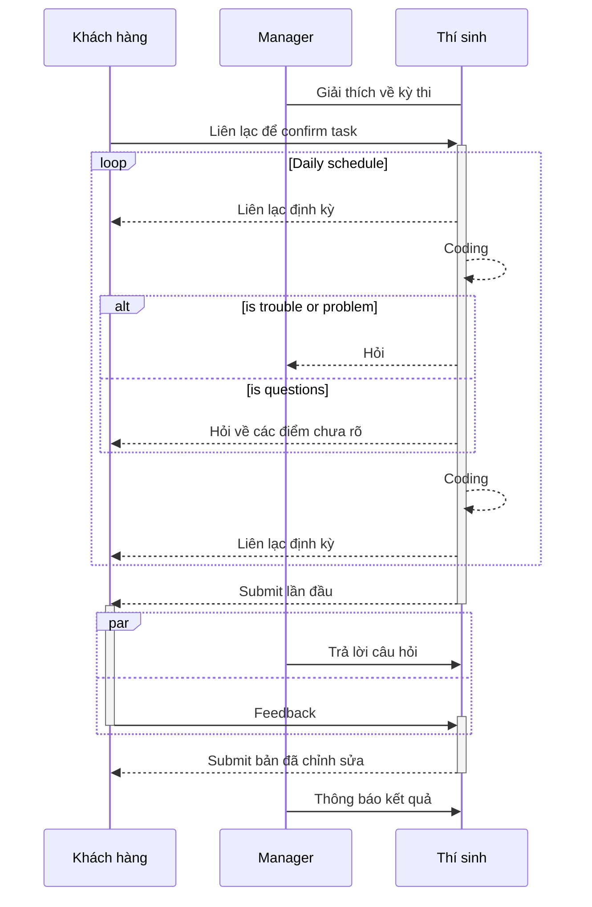

# Khái quát kỳ thi

Front-end team đã đưa vào áp dụng 1 chế độ kỳ thi để đánh giá về tính thiết thực của quá trình training nhân viên cũng như đánh giá kỹ năng cá nhân của từng nhân viên.
Có nhiều bài test được thiết lập cho từng giai đoạn của quá trình training và tất cả nhân viên trong Front-end team phải nâng cao trình độ kỹ thuật của mình để có thể vượt qua được các bài test.

Dưới đây là các kỹ năng Front-end team yêu cầu theo từng giai đoạn:

1. Kỹ năng tiêu chuẩn tối thiểu phải có - Coding có độ tái hiện design cao bằng HTML/CSS chính xác, có thể làm việc với khách hàng 1 cách suôn sẻ.
2. Kỹ năng ở cấp độ nghiệp vụ thực tế - Cấu trúc site bằng Wordpress, có thể coding Javascript/PHP cơ bản.
3. Kỹ năng trung cấp - Có khả năng thiết kế CSS cấp độ cao, có thể sử dụng Javascript Framework để tạo application.
4. Kỹ năng cao cấp - Có kiến thức về Back-end, có thể tạo Javascript Application cấp độ cao có liên kết với API bên ngoài.

Để đánh giá điều kiện「Có thể làm việc với khách hàng 1 cách suôn sẻ」được quy định trong mục「1. Kỹ năng tiêu chuẩn tối thiểu phải có」ở trên, kỳ thi sẽ được tiến hành theo hình thức mô phỏng quy trình làm việc của 1 dự án thực tế và trong đó task sẽ được cung cấp bởi giám khảo trong vai trò khách hàng.
Chi tiết về nội dung kỳ thi sẽ không được công khai cho đến ngày bắt đầu kỳ thi.

## Lịch trình của kỳ thi

Thí sinh sẽ hoàn thành việc xác nhận nội dung task trong giai đoạn chuẩn bị tiền trạm và chính thức bắt đầu thực hiện từ thời điểm chuyển giao sang ngày tiếp theo.
Thời gian thực hiện task có thể tăng giảm tùy theo nội dung bài test và thí sinh sẽ là người lên kế hoạch công việc.
Thí sinh hoàn thành task đã được giao trong thời gian thực hiện task dự kiến và nộp task vào thời điểm submit lần đầu.
Nếu có yêu cầu chỉnh sửa từ giám khảo, thí sinh sẽ thực hiện chỉnh sửa, submit lại và kết thúc kỳ thi.

**Schedule tiêu chuẩn**

- Chuẩn bị trước kỳ thi: 0.5 ngày.
- Giai đoạn thực hiện task: có thể tăng giảm tùy vào nội dung task.
- Submit lần đầu：0.5 ngày (trả lời câu hỏi, yêu cầu chỉnh sửa).
- Giai đoạn chỉnh sửa task：1.5 ngày.
- Submit task chính thức：0.5 ngày (chấm điểm sau khi chỉnh sửa).
  https://prnt.sc/toi6LV0q7Nn5

## Quy trình bài thi

Bài thi sẽ được thực hiện dưới sự giám sát của:

- Giám khảo trong vai trò khách hàng: 1 người
- Manager phụ trách trong vai trò hỗ trợ: 1 người

Kỳ thi sẽ tiến hành theo mô phỏng quy trình công việc thực tế như graph dưới đây:

https://prnt.sc/iDgjDKmr-raj

## Nội quy kỳ thi

- Đối xử với giám khảo kỳ thi như khách hàng trong suốt quá trình thi.
- Chi tiết về nội dung task (cách thức submit thành phẩm v.v.) sẽ phải tuân thủ theo thông tin khách hàng cung cấp sau khi bắt đầu kỳ thi.
- Trong quá trình thực hiện task, nếu phát sinh vấn đề khiến cho tiến độ task không đảm bảo thì phải kịp thời báo cáo với manager phụ trách.
- Nếu gặp khó khăn trong việc tiến hành follow-up task vì lý do kỹ thuật v.v. thì phải trao đổi với manager phụ trách để ưu tiên đảm bảo hoàn thành bài thi.
- Giám khảo sẽ đưa chỉ thị bằng tiếng Nhật tương tự như khi trao đổi công việc với khách hàng thực tế nên hãy sử dụng bot dịch thuật v.v. để đảm bảo hiểu rõ nội dung chỉ thị và tiến hành task.
- Nếu đã sử dụng bot dịch thuật hoặc Google dịch rồi nhưng vẫn không hiểu chỉ thị của khách hàng, hãy nhờ team dịch thuật hỗ trợ.
- Việc thực hiện task được tiến hành trong khung giờ làm việc, từ khi bắt đầu đến khi kết thúc giờ làm việc chính thức. Không cấm thí sinh OT để thực hiện task nhưng nếu có OT phải báo cáo với manager phụ trách.

## Các loại kỳ thi

### Kỳ thi tuyển dụng chính thức

_Chi tiết về kỳ thi tuyển dụng chính thức_

- [exam_for_employment-ja.md](./exam_for_employment-ja.md)
- [exam_for_employment-vn.md](./exam_for_employment-vn.md)

### Kỳ thi xét chuẩn assign

_Chi tiết về kỳ thi xét chuẩn assign_

- [exam_for_assignment-ja.md](./exam_for_assignment-ja.md)
- [exam_for_assignment-vn.md](./exam_for_assignment-vn.md)

# Quy trình kỳ thi tuyển dụng chính thức

## Khái quát về kỳ thi

Mục đích kỳ thi tuyển dụng chính thức là để đánh giá xem thí sinh có đáp ứng đủ「1. Kỹ năng tiêu chuẩn tối thiểu phải có」để trở thành thành viên Team Front-end hay không.
Kỹ năng tiêu chuẩn tối thiểu phải có ở đây bao gồm: Code chính xác để tái hiện thiết kế một cách chân thực, trao đổi làm việc trơn tru với khách hàng.
Thí sinh không vượt qua được bài thi này sẽ phải tạm hoãn việc tuyển dụng chính thức để xem xét thi lại.
Thí sinh không vượt qua mức điểm cho phép thi lại sẽ trở thành đối tượng để xem xét có tuyển dụng chính thức hay không.

## Quy chế chấm thi

- Cách chấm điểm: Theo hình thức trừ điểm
- Điểm ban đầu: 100 điểm
- Mức điểm đậu ở lần nộp cuối cùng: từ 60 điểm trở lên đối với fresher, từ 75 điểm trở lên đối với người có kinh nghiệm
- Mức điểm cho phép thi lại ở lần nộp cuối cùng: từ 50 điểm trở lên đối với fresher
- Mức điểm rớt ở lần nộp đầu tiên: dưới 35 điểm đối với fresher, từ 55 điểm trở xuống đối với người có kinh nghiệm, hoặc số lượng feedback vượt quá 25 mục

## Phương thức đánh giá bài thi

Việc chấm điểm sẽ dựa trên quy định dưới đây:
https://prnt.sc/Z6KM9_vya08v |

Ngoài ra, trường hợp không hoàn thành công việc thì sẽ không chấm điểm và xem như thi trượt.

### Về các hạng mục chấm điểm

**No.1, No.2, No.3**

- Đánh giá dựa trên việc có giữ đúng quy trình làm việc của AGL hay không, có ý thức báo cáo - liên lạc - bàn bạc với khách hàng hay không.
- Thông thường, chỉ cần biết liên lạc một cách chính xác khi cần thiết thì sẽ không bị trừ điểm.

**No.4, No.5**

- Khả năng tái hiện thiết kế tại lần nộp đầu tiên là hạng mục quan trọng nhất và sẽ được đánh giá nghiêm khắc.
- Nếu thiết kế có lỗi thì không nhất thiết phải code chính xác theo thiết kế.
  - Ví dụ: Element giống nhau mà lại lệch nhau vài px một cách không rõ nguyên nhân.
  - Ví dụ: Element giống nhau mà font-family lại khác nhau một cách không rõ nguyên nhân.
- Những element không tồn tại trong thiết kế sẽ không phải đối tượng trừ điểm của hạng mục này.
  - Ví dụ: Một vài trang sẽ không có thiết kế bản smartphone.

**No.6, No.7, No.8**

- Trường hợp có quá nhiều lỗi thì sẽ bị cho là cẩu thả trong việc kiểm tra trước khi nộp thành phẩm và do đó xem như thi trượt.

**No.9, No.10**

- Đánh giá dựa trên việc có lỗi responsive trên màn hình có kích thước trung bình được code trong tình trạng không có thiết kế hay không.
- Đánh giá dựa trên khả năng code màn hình kích cỡ smartphone trong tình trạng không có thiết kế.
- Đánh giá xem có ý thức đến việc kiểm tra cross-browser khi code không.

**No.11**

- Đánh giá chất lượng code có đạt tiêu chuẩn của Allgrow-labo hay không.

Ví dụ như cách code dưới đây sẽ bị trừ điểm.

https://prnt.sc/kYEXlT_LpYl7

**No.13, No.14**

- Đánh giá khả năng ước lượng và quản lí kế hoạch thực hiện dự án với sai số nhỏ.
- Đánh giá khả năng lập lại kế hoạch khi phát sinh vấn đề với kế hoạch cũ.

Tính trong thời gian làm việc, trường hợp nộp trễ trong vòng 4h mà có liên lạc chính xác thì sẽ không bị trừ điểm.
Tuy nhiên, dù chỉ trễ 1 phút đi nữa mà không thông báo trước hạn nộp thì sẽ bị đánh trượt ngay thời điểm đó và không tính điểm thêm về sau.

Ví dụ về việc trừ điểm do nộp trễ sẽ căn cứ trên múi giờ Việt Nam như sau:

1. Hạn nộp theo kế hoạch: 2021/10/1 17:00
   - 2021/10/2 trước hoặc đúng 12:00 　 Không trừ điểm
   - 2021/10/2 trước hoặc đúng 17:00 　-1 điểm
   - 2021/10/3 10:00 　-2 điểm (Tổng: -3 điểm)
   - 2021/10/4 15:00 　-4 điểm (Tổng: -5 điểm)
   - 2021/10/5 10:00 　-8 điểm (Tổng: -9 điểm)
2. Hạn nộp theo kế hoạch: 2021/10/1 10:00
   - 2021/10/2 trước hoặc đúng 15:00 　 Không trừ điểm
   - 2021/10/2 trước hoặc đúng 17:00 　-1 điểm
   - 2021/10/3 10:00 　-2 điểm (Tổng: -3 điểm)
   - 2021/10/4 15:00 　-4 điểm (Tổng: -5 điểm)
   - 2021/10/5 10:00 　-8 điểm (Tổng: -9 điểm)

Ngoài ra, khi liên lạc để thông báo về việc nộp trễ, tỉ lệ giữa thời gian trễ với thời gian báo trước cũng rất quan trọng.
Tức là nếu trễ khoảng 2 tiếng thì báo trước 15 phút ~ 1 tiếng cũng không có vấn đề gì to tát.
Nhưng nếu trễ trên 1 ngày mà chỉ báo trước 15 phút thì sẽ bị đánh giá là có vấn đề trong việc ước lượng thời gian thao tác.
Việc thông báo trễ sẽ bị đánh giá là có vấn đề trong năng lực quản lí kế hoạch làm việc

### Về việc submit sau khi chỉnh sửa

Khi submit thành phẩm đã phản ánh các nội dung chỉnh sửa, nếu các nội dung đó được phản ánh chính xác thì sẽ được cộng điểm ở 1 số hạng mục.
